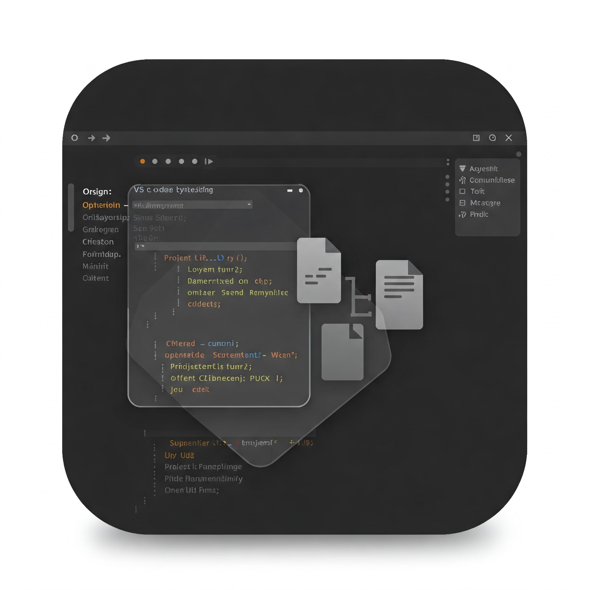

# Windsurf Linear Extension  

Integrate basic Linear workflows directly into your Visual Studio Code environment. This extension allows you to manage Linear issues without leaving your editor.

This extension utilizes the [windsurf-linear](https://github.com/jawnty/windsurf-linear) library for interacting with the Linear API via the `@linear/sdk`.

## Features

Access Linear commands directly from the VS Code Command Palette (`Cmd+Shift+P` or `Ctrl+Shift+P`):

*   **Linear: Fetch My Teams:** Lists your Linear teams in the Output panel.
*   **Linear: Fetch My Issues:** Lists issues assigned to you in the Output panel.
*   **Linear: Create Issue:** Prompts for a title, description, and team to create a new issue.
*   **Linear: Update Issue:** Prompts for an issue ID and fields (like title, description) to update.
*   **Linear: Archive Issue:** Prompts for an issue ID to archive (soft-delete).

## Requirements

*   Visual Studio Code v1.80.0 or higher.
*   A **Linear Personal API Key**. You can generate one in your Linear account settings under API > Personal API Keys.

## Extension Settings

This extension requires your Linear API key to be configured in VS Code settings:

*   `windsurf-linear-extension.apiKey`: Your Linear Personal API Key.

**How to configure:**

1.  Open VS Code Settings (`Cmd+,` or `Ctrl+,`).
2.  Search for "Windsurf Linear".
3.  Enter your API key in the `Windsurf-linear-extension: Api Key` field.

## Installation

Install directly from the [VS Code Marketplace](https://marketplace.visualstudio.com/items?itemName=jawnty.windsurf-linear-extension).

Alternatively, download the `.vsix` file from the [GitHub Releases](https://github.com/jawnty/windsurf-linear-extension/releases) page and install manually using the `Extensions: Install from VSIX...` command in VS Code.

## Known Issues

*   Currently relies on basic input prompts and Output panel logging. Future versions may introduce more sophisticated UI elements.
*   Limited error handling for invalid inputs.

## Release Notes

See the [CHANGELOG.md](changelog.md) file for details on changes in each version.

### 0.0.1

*   Initial release.
*   Connects to Linear using API key from VS Code settings.
*   Provides commands for fetching teams/issues, creating, updating, and archiving issues.

## Contributing

Contributions are welcome! Please refer to the [GitHub repository](https://github.com/jawnty/windsurf-linear-extension).

## License

[MIT](LICENSE)
